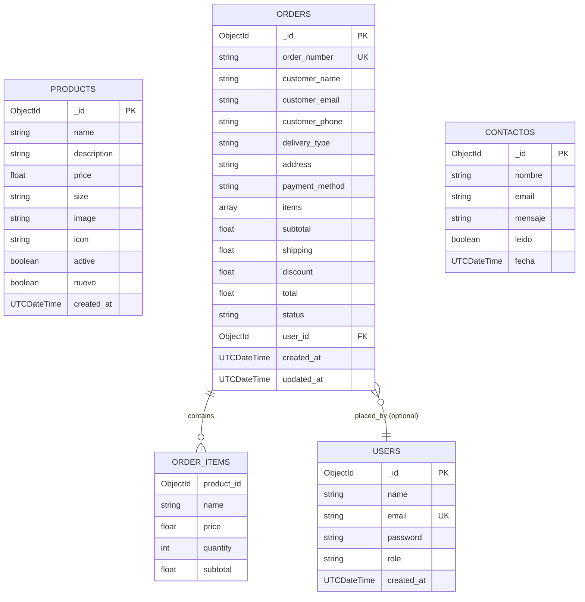

# 🗄️ Documentación de Base de Datos - MongoDB

## 📋 Tabla de Contenidos
- [Visión General](#visión-general)
- [Colecciones](#colecciones)
- [Modelo de Datos (Mermaid)](#modelo-de-datos-mermaid)
- [Esquemas Detallados](#esquemas-detallados)
- [Índices y Optimización](#índices-y-optimización)
- [Relaciones](#relaciones)
- [Consultas Comunes](#consultas-comunes)

---

## 🎯 Visión General

**Motor de Base de Datos:** MongoDB 7.0  
**Base de Datos:** `coffeeshop`  
**Colecciones:** 4 principales  
**Tipo:** NoSQL orientada a documentos

### Decisiones de Diseño
- ✅ **NoSQL**: Flexibilidad en esquemas y escalabilidad horizontal
- ✅ **Documentos embebidos**: Items de pedidos dentro de orders (desnormalización intencional)
- ✅ **Soft delete**: Productos con campo `active` en lugar de eliminar
- ✅ **UTCDateTime**: Todas las fechas en formato ISO 8601
- ✅ **ObjectId**: IDs generados automáticamente por MongoDB

---

## 📦 Colecciones

| Colección | Propósito | Documentos | Relaciones |
|-----------|-----------|-----------|------------|
| `products` | Catálogo de productos | ~20-50 | Ninguna (independiente) |
| `orders` | Pedidos de clientes | Ilimitado | Referencia a `users` (opcional) |
| `users` | Usuarios del sistema | Ilimitado | Ninguna |
| `contactos` | Mensajes de contacto | Ilimitado | Ninguna |

---

## 🔗 Modelo de Datos (Mermaid)



### Diagrama de Relaciones Visual

```
┌─────────────┐
│  PRODUCTS   │ (Independiente, sin relaciones)
│  Catálogo   │
└─────────────┘

┌─────────────┐         ┌─────────────┐
│   USERS     │────────▶│   ORDERS    │
│ (opcional)  │  0..n   │             │
└─────────────┘         └──────┬──────┘
                               │
                               │ embebidos
                               ▼
                        ┌─────────────┐
                        │ order.items │
                        │   (array)   │
                        └─────────────┘

┌─────────────┐
│ CONTACTOS   │ (Independiente, sin relaciones)
│  Mensajes   │
└─────────────┘
```

---

## 📊 Esquemas Detallados

### 1. 📦 Colección: `products`

**Propósito:** Almacenar el catálogo de productos disponibles para la venta.

**Estructura del Documento:**

```javascript
{
  _id: ObjectId("673855a9c7f8a2b1d4e5f6a7"),
  name: "Café Americano",
  description: "Café negro clásico preparado con granos seleccionados",
  price: 2500.0,
  size: "M",
  image: "https://i.postimg.cc/abc123/americano.jpg",
  icon: "bi-cup-hot",
  active: true,
  nuevo: false,
  created_at: ISODate("2024-11-16T10:30:00.000Z")
}
```

**Campos:**

| Campo | Tipo | Obligatorio | Descripción |
|-------|------|-------------|-------------|
| `_id` | ObjectId | ✅ Sí (auto) | Identificador único del producto |
| `name` | String | ✅ Sí | Nombre del producto (ej: "Café Americano") |
| `description` | String | ✅ Sí | Descripción detallada del producto |
| `price` | Float | ✅ Sí | Precio en pesos chilenos (sin separador de miles) |
| `size` | String | ✅ Sí | Tamaño: "S", "M", "L", "XL" |
| `image` | String | ✅ Sí | URL externa de la imagen (Postimg, etc.) |
| `icon` | String | ✅ Sí | Clase de Bootstrap Icons (ej: "bi-cup-hot") |
| `active` | Boolean | ✅ Sí | `true` = visible en menú, `false` = oculto (soft delete) |
| `nuevo` | Boolean | ❌ No | `true` = badge "Nuevo" en UI, `false` = sin badge |
| `created_at` | UTCDateTime | ❌ No | Fecha de creación del producto |

**Índices:**
```javascript
db.products.createIndex({ active: 1 })  // Filtrar productos activos
db.products.createIndex({ name: 1 })    // Búsqueda por nombre
```

**Soft Delete Implementation:**
- Productos con `active: false` NO aparecen en el menú público
- Productos con `active: false` SÍ aparecen en panel admin con indicador
- Pedidos antiguos mantienen referencia al producto aunque esté desactivado

---

### 2. 🛒 Colección: `orders`

**Propósito:** Almacenar todos los pedidos realizados por clientes (con o sin cuenta).

**Estructura del Documento:**

```javascript
{
  _id: ObjectId("6739238c4ef5a1b2c3d4e5f6"),
  order_number: "ORD-6739238C4EF5A",
  customer_name: "Juan Pérez",
  customer_email: "juan@email.com",
  customer_phone: "+56912345678",
  delivery_type: "delivery",
  address: "Av. Libertador 123, Santiago",
  payment_method: "credit_card",
  items: [
    {
      product_id: ObjectId("673855a9c7f8a2b1d4e5f6a7"),
      name: "Café Americano",
      price: 2500.0,
      quantity: 2,
      subtotal: 5000.0
    },
    {
      product_id: ObjectId("673855b2c7f8a2b1d4e5f6a8"),
      name: "Cappuccino",
      price: 3200.0,
      quantity: 1,
      subtotal: 3200.0
    }
  ],
  subtotal: 8200.0,
  shipping: 3000.0,
  discount: 1230.0,
  total: 9970.0,
  status: "pending",
  user_id: ObjectId("673821a5b2c3d4e5f6a7b8c9"),
  created_at: ISODate("2024-11-17T14:35:00.000Z"),
  updated_at: ISODate("2024-11-17T14:35:00.000Z")
}
```

**Campos Principales:**

| Campo | Tipo | Obligatorio | Descripción |
|-------|------|-------------|-------------|
| `_id` | ObjectId | ✅ Sí (auto) | Identificador único del pedido |
| `order_number` | String | ✅ Sí | Número de orden único (formato: ORD-{ObjectId}) |
| `customer_name` | String | ✅ Sí | Nombre del cliente |
| `customer_email` | String | ✅ Sí | Email del cliente (usado para descuentos) |
| `customer_phone` | String | ✅ Sí | Teléfono de contacto |
| `delivery_type` | String | ✅ Sí | Tipo: `"delivery"` o `"pickup"` |
| `address` | String | ❌ No | Dirección (solo si `delivery_type = "delivery"`) |
| `payment_method` | String | ✅ Sí | Método: `"credit_card"`, `"cash"`, `"transfer"` |
| `items` | Array | ✅ Sí | Lista de productos del pedido (embebidos) |
| `subtotal` | Float | ✅ Sí | Suma de items sin envío ni descuento |
| `shipping` | Float | ✅ Sí | Costo de envío ($3,000 delivery, $0 pickup) |
| `discount` | Float | ✅ Sí | Descuento aplicado (15% primer pedido) |
| `total` | Float | ✅ Sí | Total final = subtotal + shipping - discount |
| `status` | String | ✅ Sí | Estado: `"pending"`, `"preparing"`, `"ready"`, `"delivered"` |
| `user_id` | ObjectId | ❌ No | Referencia a `users._id` (null si compra sin cuenta) |
| `created_at` | UTCDateTime | ✅ Sí | Fecha de creación del pedido |
| `updated_at` | UTCDateTime | ✅ Sí | Última actualización (cambio de estado) |

**Subcampo: `items` (array embebido)**

| Campo | Tipo | Descripción |
|-------|------|-------------|
| `product_id` | ObjectId | Referencia a `products._id` |
| `name` | String | Nombre del producto (snapshot) |
| `price` | Float | Precio unitario al momento de la compra |
| `quantity` | Integer | Cantidad solicitada |
| `subtotal` | Float | price × quantity |

**Estados del Pedido:**

| Estado | Descripción | Visible para | Actualizado por |
|--------|-------------|--------------|-----------------|
| `pending` | Recién creado, pendiente confirmación | Cliente, Empleado, Admin | Sistema (auto) |
| `preparing` | En preparación por el equipo | Cliente, Empleado, Admin | Empleado/Admin |
| `ready` | Listo para entrega o retiro | Cliente, Empleado, Admin | Empleado/Admin |
| `delivered` | Entregado al cliente | Cliente, Empleado, Admin | Empleado/Admin |

**Índices:**
```javascript
db.orders.createIndex({ order_number: 1 }, { unique: true })   // Búsqueda rápida por número
db.orders.createIndex({ customer_email: 1 })                   // Validar descuentos
db.orders.createIndex({ status: 1 })                           // Filtrar por estado
db.orders.createIndex({ user_id: 1 })                          // Historial de usuario
db.orders.createIndex({ created_at: -1 })                      // Ordenar por fecha DESC
```

**Cálculos:**
```javascript
subtotal = Σ (item.price × item.quantity)
shipping = delivery_type === "delivery" ? 3000 : 0
discount = first_order ? (subtotal × 0.15) : 0
total = subtotal + shipping - discount
```

---

### 3. 👤 Colección: `users`

**Propósito:** Almacenar cuentas de usuarios (clientes, empleados, administradores).

**Estructura del Documento:**

```javascript
{
  _id: ObjectId("673821a5b2c3d4e5f6a7b8c9"),
  name: "Juan Pérez",
  email: "juan@email.com",
  password: "$2y$10$abcdefghijklmnopqrstuvwxyz123456789",
  role: "cliente",
  created_at: ISODate("2024-11-15T09:20:00.000Z")
}
```

**Campos:**

| Campo | Tipo | Obligatorio | Descripción |
|-------|------|-------------|-------------|
| `_id` | ObjectId | ✅ Sí (auto) | Identificador único del usuario |
| `name` | String | ✅ Sí | Nombre completo del usuario |
| `email` | String | ✅ Sí | Email único (usado para login) |
| `password` | String | ✅ Sí | Contraseña hasheada con `password_hash()` (bcrypt) |
| `role` | String | ✅ Sí | Rol: `"cliente"`, `"trabajador"`, `"administrador"` |
| `created_at` | UTCDateTime | ❌ No | Fecha de registro |

**Roles y Permisos:**

| Rol | Acceso | Descripción |
|-----|--------|-------------|
| `cliente` | Limitado | Ver productos, hacer pedidos, ver historial propio |
| `trabajador` | Medio | Gestionar estados de pedidos, ver todos los pedidos |
| `administrador` | Completo | Dashboard, reportes, productos, mensajes, todo |

**Índices:**
```javascript
db.users.createIndex({ email: 1 }, { unique: true })  // Login único
db.users.createIndex({ role: 1 })                     // Filtrar por rol
```

**Seguridad:**
- Contraseñas hasheadas con `password_hash()` usando bcrypt
- Costo de hash: 10 rounds (balance seguridad/performance)
- Email case-insensitive en queries

---

### 4. 📧 Colección: `contactos`

**Propósito:** Almacenar mensajes enviados por clientes a través del formulario de contacto.

**Estructura del Documento:**

```javascript
{
  _id: ObjectId("6738f4c5d3e2a1b9c8d7e6f5"),
  nombre: "María González",
  email: "maria@email.com",
  mensaje: "Hola, quisiera saber los horarios de atención para el fin de semana. ¿Abren domingos?",
  leido: false,
  fecha: ISODate("2024-11-16T16:45:00.000Z")
}
```

**Campos:**

| Campo | Tipo | Obligatorio | Descripción |
|-------|------|-------------|-------------|
| `_id` | ObjectId | ✅ Sí (auto) | Identificador único del mensaje |
| `nombre` | String | ✅ Sí | Nombre del remitente |
| `email` | String | ✅ Sí | Email del remitente |
| `mensaje` | String | ✅ Sí | Contenido del mensaje |
| `leido` | Boolean | ✅ Sí | `false` = nuevo, `true` = leído por admin |
| `fecha` | UTCDateTime | ✅ Sí | Fecha de envío del mensaje |

**Índices:**
```javascript
db.contactos.createIndex({ fecha: -1 })   // Ordenar por fecha DESC
db.contactos.createIndex({ leido: 1 })    // Filtrar no leídos
```

**Flujo:**
1. Cliente envía mensaje desde `/contact`
2. Se guarda con `leido: false`
3. Aparece en dashboard admin con badge "Nuevo"
4. Admin puede marcar como leído
5. Se actualiza `leido: true`

---

## 🔍 Índices y Optimización

### Índices Creados

```javascript
// Colección: products
db.products.createIndex({ active: 1 })
db.products.createIndex({ name: 1 })

// Colección: orders
db.orders.createIndex({ order_number: 1 }, { unique: true })
db.orders.createIndex({ customer_email: 1 })
db.orders.createIndex({ status: 1 })
db.orders.createIndex({ user_id: 1 })
db.orders.createIndex({ created_at: -1 })

// Colección: users
db.users.createIndex({ email: 1 }, { unique: true })
db.users.createIndex({ role: 1 })

// Colección: contactos
db.contactos.createIndex({ fecha: -1 })
db.contactos.createIndex({ leido: 1 })
```

### Estrategias de Optimización

| Estrategia | Implementación | Beneficio |
|------------|----------------|-----------|
| **Desnormalización** | Items embebidos en orders | Evita JOINs, lectura rápida |
| **Índices compuestos** | customer_email + created_at | Consultas de descuento rápidas |
| **Soft delete** | Campo `active` en products | Mantiene historial sin eliminar |
| **Snapshots** | Guardar precio en items | Evita inconsistencias si cambia precio |
| **Índice único** | email en users, order_number en orders | Garantiza unicidad |

---

## 🔗 Relaciones

### Tipo de Relaciones

```
1. users (1) ←→ (N) orders
   - Un usuario puede tener muchos pedidos
   - Un pedido puede tener un usuario (o ninguno si es guest)
   - Relación: user_id en orders (nullable)

2. products (1) ←→ (N) order.items
   - Un producto puede estar en muchos pedidos
   - Un item de pedido referencia un producto
   - Relación: product_id en items (embebido)
   - Nota: Se guarda snapshot del nombre y precio

3. Independientes:
   - contactos (sin relaciones)
   - products (sin relaciones directas)
```

### Integridad Referencial

❌ **No hay foreign keys** (MongoDB no las tiene)

✅ **Integridad a nivel de aplicación:**
- `user_id` puede ser null (compras sin cuenta)
- `product_id` en items es solo referencia (no validada)
- Si un producto se desactiva, pedidos antiguos mantienen el snapshot

---

## 📝 Consultas Comunes

### Productos Activos
```javascript
db.products.find({ active: true })
```

### Pedidos de un Cliente (por email)
```javascript
db.orders.find({ 
  customer_email: "juan@email.com" 
}).sort({ created_at: -1 })
```

### Verificar si es Primer Pedido (descuento)
```javascript
db.orders.countDocuments({ 
  customer_email: "maria@email.com" 
})
// Si devuelve 0 → primer pedido → aplica descuento
```

### Pedidos Pendientes
```javascript
db.orders.find({ 
  status: "pending" 
}).sort({ created_at: 1 })
```

### Historial de Pedidos de Usuario Registrado
```javascript
db.orders.find({ 
  user_id: ObjectId("673821a5b2c3d4e5f6a7b8c9") 
}).sort({ created_at: -1 })
```

### Buscar Pedido por Número
```javascript
db.orders.findOne({ 
  order_number: "ORD-6739238C4EF5A" 
})
```

### Mensajes No Leídos
```javascript
db.contactos.find({ 
  leido: false 
}).sort({ fecha: -1 })
```

### Top 5 Productos por Ventas
```javascript
db.orders.aggregate([
  { $match: { status: "delivered" } },
  { $unwind: "$items" },
  { $group: {
      _id: "$items.product_id",
      name: { $first: "$items.name" },
      total_vendido: { $sum: "$items.subtotal" },
      cantidad: { $sum: "$items.quantity" }
  }},
  { $sort: { total_vendido: -1 } },
  { $limit: 5 }
])
```

### Ingresos Totales del Mes
```javascript
db.orders.aggregate([
  { $match: {
      status: "delivered",
      created_at: {
        $gte: ISODate("2024-11-01T00:00:00.000Z"),
        $lt: ISODate("2024-12-01T00:00:00.000Z")
      }
  }},
  { $group: {
      _id: null,
      total: { $sum: "$total" },
      pedidos: { $sum: 1 }
  }}
])
```

---

## 🔐 Consideraciones de Seguridad

### Datos Sensibles

| Campo | Colección | Protección |
|-------|-----------|------------|
| `password` | users | ✅ Hasheado con bcrypt (cost 10) |
| `email` | users, orders, contactos | ⚠️ Texto plano (necesario para negocio) |
| `customer_phone` | orders | ⚠️ Texto plano (necesario para entrega) |
| `address` | orders | ⚠️ Texto plano (necesario para delivery) |

### Validaciones

✅ **Aplicación valida:**
- Email formato válido
- Teléfono formato válido
- Campos obligatorios completos
- Precios > 0
- Cantidad > 0

✅ **MongoDB valida:**
- Índices únicos (email, order_number)
- Tipos de datos correctos

---

## 📈 Métricas y Tamaño

### Estimación de Crecimiento

| Colección | Tamaño/Doc | Docs/Mes | Crecimiento/Mes |
|-----------|------------|----------|-----------------|
| `products` | ~500 bytes | +5 | ~2.5 KB |
| `orders` | ~2 KB | +300 | ~600 KB |
| `users` | ~200 bytes | +50 | ~10 KB |
| `contactos` | ~300 bytes | +20 | ~6 KB |

**Total estimado:** ~620 KB/mes (~7.5 MB/año)

### Backup

```bash
# Exportar toda la base de datos
mongodump --db=coffeeshop --out=/backup/

# Restaurar
mongorestore --db=coffeeshop /backup/coffeeshop/
```

---

## 🚀 Comandos Útiles

### Crear Base de Datos e Insertar Datos de Prueba

```javascript
// Conectar a MongoDB
use coffeeshop

// Insertar productos
db.products.insertMany([
  {
    name: "Café Americano",
    description: "Café negro clásico",
    price: 2500.0,
    size: "M",
    image: "https://i.postimg.cc/abc123/americano.jpg",
    icon: "bi-cup-hot",
    active: true,
    nuevo: false,
    created_at: new Date()
  },
  {
    name: "Cappuccino",
    description: "Espresso con leche espumada",
    price: 3200.0,
    size: "M",
    image: "https://i.postimg.cc/def456/cappuccino.jpg",
    icon: "bi-cup-straw",
    active: true,
    nuevo: true,
    created_at: new Date()
  }
])

// Crear índices
db.products.createIndex({ active: 1 })
db.orders.createIndex({ order_number: 1 }, { unique: true })
db.users.createIndex({ email: 1 }, { unique: true })
db.contactos.createIndex({ fecha: -1 })
```

---

## 📚 Referencias

- **MongoDB Manual:** https://docs.mongodb.com/manual/
- **PHP MongoDB Driver:** https://www.php.net/manual/en/set.mongodb.php
- **Mermaid Diagrams:** https://mermaid.js.org/

---

**Base de datos optimizada para e-commerce con alta disponibilidad y consultas rápidas** 🚀
